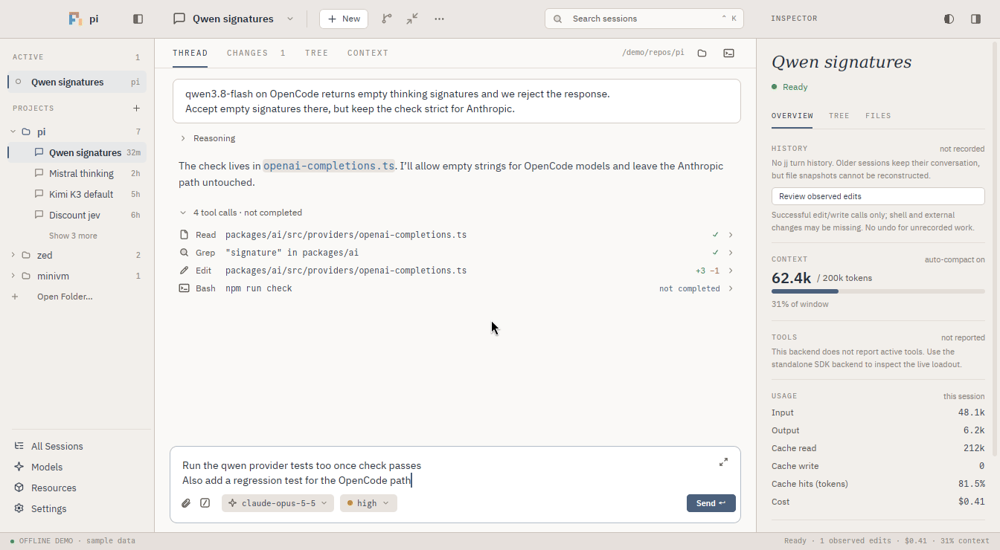
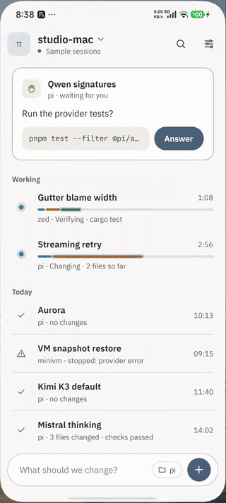

# Pi Desktop

A native desktop app for the [pi](https://github.com/earendil-works/pi) coding agent, built with Zed's GPUI (no webview). Each session runs its own pi process in its project folder.

<table>
  <tr>
    <td></td>
    <td width="240"></td>
  </tr>
  <tr>
    <td align="center">Pi Desktop on macOS</td>
    <td align="center"><a href="crates/pi_android/README.md">Pi for Android</a></td>
  </tr>
</table>

- **Sessions and projects** in a sidebar, with search, forks and worktrees.
- **Thread** with readable Markdown and Mermaid, the screenshots and HTML pages Pi made, collapsible tools, and a composer with `/` commands, `@` mentions and attachments.
- **Changes** as split or unified diffs; each run that edits files can become a jj change you can undo.
- **Files, terminal, language servers, models and settings** in the same window.
- **Remote sessions over SSH** that keep running when you disconnect ([docs/remote.md](docs/remote.md)).
- **[Pi for Android](crates/pi_android/README.md)**, which follows and starts sessions on your computer over SSH. Every phone session runs on [pi-durable](#durable-sessions-experimental), so it carries on while the phone is away. Get `pi-android-arm64.apk` from the [releases](https://github.com/ejpir/pig/releases).

## Build and run

Keep a checkout of [Zed](https://github.com/zed-industries/zed) next to this repository (revision `5becf8b5910fd538ccc5489e8edd3fde32917fad`):

```text
repos/
  pi-desktop/
  zed/
```

You need rustup and CMake (macOS: Xcode Command Line Tools and `brew install cmake`).

Fetch pi's release build, point the build at it, and run:

```sh
python3 scripts/fetch_pi.py    # writes artifacts/pi/pi-<platform>.tar.gz
export PI_DESKTOP_BACKEND_ARCHIVE=$PWD/artifacts/pi/pi-darwin-arm64.tar.gz
cargo run --release --locked -p pi-desktop --features bundled-backend -- --project /path/to/project
```

On Linux, use the `pi-linux-x64` or `pi-linux-arm64` archive instead. pi is built into the app, so you don't need Node.js or pi installed. Your existing pi settings and sign-ins in `~/.pi/agent` are reused.

Real sessions use your provider credentials and can edit files, just like pi. To try the app offline with sample sessions, add `--demo`.

To record the tour above again, run `scripts/macos-demo/record.sh` after a release build.

## Durable sessions (experimental)

Pi Desktop can also run sessions with a durable engine built on pi-durable. A session's state lives in SQLite on the computer that runs it, so the session survives disconnects and crashes and resumes where it was. Use it for SSH sessions (**New session → SSH → Durable · experimental**). [Pi for Android](crates/pi_android/README.md) always uses it: every session the phone starts is a durable one on your computer.

The macOS and Linux SSH helpers in the [releases](https://github.com/ejpir/pig/releases) (`pi-desktop-remote-*`) have the engine built in. Local sessions don't need it; the steps above are enough. To build the engine into the helper yourself, on the machine that will run the sessions (it needs npm and Bun 1.4.2):

```sh
(cd backend/durable && npm ci --ignore-scripts && bun run build)
PI_DESKTOP_DURABLE_BINARY=$PWD/artifacts/durable/pi-desktop-durable \
  cargo build --release --locked -p pi_remote --features bundled-durable
```

To pair a phone with the computer, install the helper as `~/.pi/desktop/bin/pi-desktop-remote` (turn on SSH first; on a Mac, **System Settings → General → Sharing → Remote Login**) and run:

```sh
~/.pi/desktop/bin/pi-desktop-remote pair
```

In the Android app, tap **Scan computer QR** and scan the code in the terminal. Check that both devices show the same six-digit code, then press Enter on the computer. Pairing goes through the computer's own SSH server and installs a phone key that can run only the helper. If the phone can't reach the address it found, add `--host <address>`; a Tailscale name or an IP works. The QR expires after two minutes (`--expires <seconds>` changes that). See [Pi for Android](crates/pi_android/README.md#connect) for manual SSH-key setup.

See [docs/remote.md](docs/remote.md#experimental-durable-backend) for what it supports and how to install the helper, and [backend/durable](backend/durable/README.md) for its tests.

## Test

```sh
cargo test --locked --workspace
```

See [docs/validation.md](docs/validation.md) for the full checks and [docs/architecture.md](docs/architecture.md) for how it works, including packaging.

## Keys

| Keys | Action |
|---|---|
| Ctrl/Cmd+N | New session |
| Ctrl/Cmd+O | Open folder |
| Ctrl/Cmd+K | Search |
| Ctrl/Cmd+B | Sidebar |
| Ctrl/Cmd+J | Terminal |
| Enter | Send, or queue a follow-up while pi works |
| Ctrl/Cmd+Enter | Steer the current run |
| Escape | Stop |

## License

GPL-3.0-or-later ([LICENSE](LICENSE)), because the app links Zed's GPL crates. Third-party notices are in [THIRD_PARTY.md](THIRD_PARTY.md) and `licenses/`.
